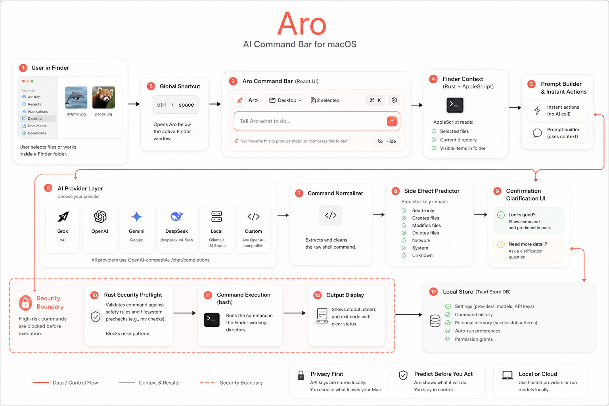
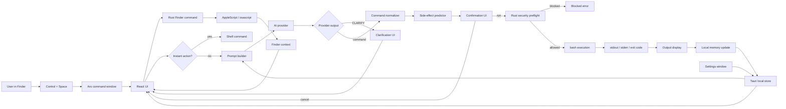

# End-to-End Architecture

This document explains how Aro works from the moment the user presses the shortcut to the moment command output is shown.

## Visual Overview



## System Diagram



## 1. Summon

The app registers `Control + Space` through `tauri-plugin-global-shortcut`.

When the shortcut fires:

1. Rust toggles the main window.
2. The window is shown and focused.
3. Rust positions it below the front Finder window.
4. Escape capture is registered while Aro is visible, so Escape can hide Aro even when focus behaves badly.

Relevant files:

- `src-tauri/src/lib.rs`
- `src-tauri/src/commands/window.rs`
- `src/hooks/useGlobalShortcut.ts`

What is happening technically:

- `src-tauri/src/lib.rs` registers the global shortcut through `tauri-plugin-global-shortcut`.
- The shortcut handler calls `toggle_main_window`.
- If the window is hidden, Rust calls `show_main_window`.
- `show_main_window` shows the Tauri webview, positions it, focuses it, emits `aro:shown`, and enables temporary Escape capture.
- If the window is already visible, Rust calls `hide_main_window`.
- `hide_main_window` hides the webview and unregisters Escape capture so the key goes back to normal macOS/app behavior.

The Escape handling exists because overlay windows can lose webview focus. A frontend-only `keydown` handler is not enough when another app accidentally owns focus.

## 2. Finder Context

The frontend asks Rust for Finder context.

Rust calls AppleScript through `osascript` and returns:

- selected file paths
- current Finder directory
- visible directory items in the current folder

This is why Aro can understand prompts like:

```text
rename this selected file to receipt.txt
```

without the user manually pasting a file path.

Relevant files:

- `src/hooks/useFinderContext.ts`
- `src-tauri/src/commands/finder.rs`

Finder context shape:

```ts
interface FinderContext {
  selected_files: string[];
  current_directory: string;
  directory_items: Array<{
    name: string;
    path: string;
    kind: "file" | "folder" | string;
  }>;
}
```

Why Aro uses both selected files and visible items:

- Selected files are the strongest signal. If a file is selected, Aro should use that file.
- Visible items are the fallback. If nothing is selected, Aro can still reason about exact names in the current Finder folder.
- If the user says something vague and multiple visible items match, Aro asks a clarification question.

macOS permission behavior:

- Finder Automation permission is needed for AppleScript Finder access.
- Accessibility/Input Monitoring may be needed for global shortcut and focus behavior depending on the local macOS privacy state.

## 3. Local Decision Layer

Before using an AI provider, Aro checks local deterministic logic.

It handles:

- known instant actions
- vague-target detection
- rename ambiguity
- selected-file shortcuts

If the user says something vague like:

```text
rename the image to animal.jpg
```

and there are multiple image files, Aro asks for clarification instead of generating a fake path.

Relevant files:

- `src/lib/instant-actions.ts`
- `src/App.tsx`
- `src/components/ClarificationCard.tsx`

This layer matters because many common file actions do not need an AI call.

Examples:

- `jpg` with selected images can become a deterministic `sips` conversion.
- `zip this folder` can become a deterministic `zip` command.
- `word count` with selected files can become `wc -w`.

The local layer also blocks a common failure mode: generated paths such as `the file`, `the image`, or `images`. Those are not real filesystem targets. Aro should ask the user what exact file they mean.

## 4. Prompt Builder

If local logic cannot solve the request, Aro builds a provider prompt.

The prompt includes:

- current Finder directory
- selected files
- visible folder items
- user personalization settings
- local memory patterns
- strict output format rules

The provider must return one of:

```text
CLARIFY: one short question
```

or:

```text
one shell command
```

Relevant files:

- `src/hooks/useGrok.ts`
- `src-tauri/src/commands/grok.rs`
- `src/lib/llm-settings.ts`

The frontend sends this request to Rust:

```ts
{
  provider: "grok" | "openai" | "gemini" | "deepseek" | "ollama" | "custom";
  apiKey: string;
  model: string;
  baseUrl: string;
  userPrompt: string;
  personalization: string;
  selectedFiles: string[];
  currentDirectory: string;
  directoryItems: DirectoryItemContext[];
}
```

Rust then builds a system prompt that tells the model:

- use absolute paths
- quote every path
- prefer selected files over guesses
- use exact visible folder items only when no file is selected
- output `CLARIFY:` if the target is unclear
- do not invent placeholder paths
- avoid destructive commands unless explicitly requested
- prefer creating new output files instead of overwriting originals

This prompt is not the final safety boundary. It improves model behavior, but the Rust preflight is still required.

## 5. Provider Layer

Aro supports hosted and local OpenAI-compatible providers:

- Grok
- OpenAI
- Gemini
- DeepSeek
- Local
- Custom

DeepSeek defaults to:

```text
deepseek-v4-flash
```

Local mode works with OpenAI-compatible local servers such as Ollama or LM Studio.

Provider routing:

| Provider | Default endpoint behavior |
| --- | --- |
| Grok | `https://api.x.ai/v1/chat/completions` |
| OpenAI | `https://api.openai.com/v1/chat/completions` |
| Gemini | Gemini OpenAI-compatible endpoint |
| DeepSeek | `https://api.deepseek.com/chat/completions` |
| Local | local OpenAI-compatible server, usually `http://localhost:11434/v1/chat/completions` |
| Custom | user-defined OpenAI-compatible base URL |

All provider responses are treated as untrusted text until normalized, previewed, and preflighted.

## 6. Command Normalization

Provider output is cleaned before preview:

- markdown fences are removed
- leading `$` is removed
- only the first command line is kept unless it is a clarification response
- placeholder paths are rejected upstream when possible

Relevant file:

- `src-tauri/src/commands/grok.rs`

Examples:

```text
$ wc -l "/Users/me/Desktop/file.txt"
```

becomes:

```text
wc -l "/Users/me/Desktop/file.txt"
```

```text
```bash
mv "old.txt" "new.txt"
```
```

becomes:

```text
mv "old.txt" "new.txt"
```

If the model returns a clarification, it is not treated as a shell command.

## 7. Side-Effect Prediction

Aro predicts broad command impact:

- read-only
- creates files
- modifies files
- deletes files
- network
- system
- unknown

The prediction is shown in the UI before execution.

Relevant files:

- `src-tauri/src/commands/predict.rs`
- `src/components/CommandPreview.tsx`

Prediction is keyword-based and intentionally conservative. It is meant to help the user review commands faster. It is not a sandbox.

Examples:

- `ls`, `cat`, `wc`, `file`, `mdls`, `stat` are treated as read-only.
- `zip`, `cp`, `mkdir`, `sips`, `ffmpeg`, `pandoc` usually create files.
- `mv` modifies file paths.
- `rm` and trash-style commands are high risk.
- `curl`, `wget`, `brew` imply network.
- `sudo`, `defaults`, `launchctl`, `pmset` imply system changes.

## 8. Confirmation or Auto-Run

The user sees:

- the raw command
- predicted side effect
- Run / Cancel controls

Auto-run can be enabled for lower-risk categories in Settings. Higher-risk and unknown actions should still require review.

Relevant files:

- `src/App.tsx`
- `src/components/Settings.tsx`

State flow in `App.tsx`:

```text
input submitted
  -> reset old preview/output/error
  -> refresh Finder context
  -> local clarification check
  -> instant action or provider request
  -> normalize result
  -> clarification UI or command preview
  -> prediction
  -> optional auto-run or user confirmation
```

Auto-run is controlled by category. For example, a user can allow read-only commands to run immediately while keeping modification and deletion flows behind confirmation.

## 9. Rust Security Preflight

Before execution, Rust applies backend checks.

Aro refuses known high-risk patterns, including:

- `sudo`
- `diskutil`
- `launchctl`
- `pmset`
- `osascript`
- `dd`
- `mkfs`
- downloaded scripts piped into `sh`, `bash`, or `zsh`
- broad recursive deletion such as `rm -rf /`

For simple `mv` commands, it also checks:

- source exists
- destination parent exists
- folder is not moved into itself

Relevant file:

- `src-tauri/src/commands/shell.rs`

This is the most important safety layer because it runs after AI output and before shell execution.

The preflight has two jobs:

1. Reject clearly dangerous command families and shell patterns.
2. Catch common file-operation mistakes before they touch the filesystem.

For rename/move operations, Aro checks actual filesystem state. If the source path does not exist, it refuses to run. This prevents failures like trying to rename:

```text
/Users/me/Desktop/folder/the image
```

when no such file exists.

## 10. Execution

If preflight passes, Rust runs:

```text
bash -c "<generated command>"
```

inside the Finder working directory.

It returns:

- stdout
- stderr
- exit code
- success boolean

Relevant file:

- `src-tauri/src/commands/shell.rs`

Execution result shape:

```ts
interface CommandResult {
  stdout: string;
  stderr: string;
  exit_code: number;
  success: boolean;
}
```

The command runs in the current Finder directory, so relative command behavior matches the folder the user is looking at. Aro still prefers absolute paths for file references because they are easier to inspect and safer to execute.

## 11. Output and Memory

React displays the command result. Successful command patterns can update local memory so Aro becomes more aligned with the user's repeated workflows.

Memory stays local unless it is included as prompt context for the provider the user selected.

Relevant files:

- `src/components/OutputDisplay.tsx`
- `src/lib/memory.ts`
- `src/App.tsx`

Memory is updated only after successful runs. The goal is to capture patterns such as:

- preferred naming style
- repeated conversions
- common target folders
- whether the user tends to prefer same-folder outputs

Memory is local. If a hosted provider is selected, relevant memory snippets may be included in future prompts as personalization context.

## 12. Settings and Privacy

Settings are stored in the local Tauri store.

Stored locally:

- provider choice
- API keys
- model names
- auto-run categories
- command history
- personalization memory

These files are not part of the repository or release source ZIP.

Relevant files:

- `src/components/Settings.tsx`
- `src/components/SettingsWindow.tsx`
- `src/lib/llm-settings.ts`

Settings sections:

- General: shortcut and basic behavior.
- Providers: API keys, base URLs, and model names.
- Safety: auto-run categories.
- Personal Brain: command style, output preference, custom instructions.
- Memory: local learned patterns.
- Permissions: shortcuts to macOS privacy panes.

## Full Example: Rename One Selected File

User action:

```text
Select alpha notes.txt in Finder.
Ask: rename this selected file to alpha-renamed.txt
```

Runtime:

1. Aro opens below Finder.
2. React requests Finder context.
3. Rust returns selected file path:

   ```text
   /Users/pulkitaggarwal/Desktop/Aro Test Files/alpha notes.txt
   ```

4. Aro sees the target is selected and exact.
5. The model or instant-action layer produces:

   ```bash
   mv "/Users/pulkitaggarwal/Desktop/Aro Test Files/alpha notes.txt" "/Users/pulkitaggarwal/Desktop/Aro Test Files/alpha-renamed.txt"
   ```

6. Side-effect prediction marks it as a rename/move operation.
7. The user confirms.
8. Rust preflight checks:

   - source exists
   - destination parent exists
   - folder is not being moved into itself

9. Rust runs the command.
10. React shows success or stderr.
11. Aro records the successful pattern locally.

## Full Example: Ambiguous Image Rename

User action:

```text
No file selected.
Folder contains dolphin.jpg and panda.jpg.
Ask: rename the image to animal.jpg
```

Runtime:

1. Rust returns no selected files.
2. Rust returns visible folder items including both images.
3. Local ambiguity logic detects that `the image` is not exact.
4. Aro asks:

   ```text
   Which image do you want to rename to animal.jpg: dolphin.jpg or panda.jpg?
   ```

5. No shell command is shown.
6. Nothing runs until the user gives the missing detail.

## Failure Modes

| Failure | What Aro should do |
| --- | --- |
| Finder permission missing | Show Finder permission warning and avoid guessing context. |
| API key missing | Open settings instead of sending a request. |
| Provider returns `CLARIFY:` | Show clarification UI. |
| Provider returns markdown | Strip formatting before preview. |
| Provider invents a path | Ask clarification or block in preflight if source does not exist. |
| Command is high risk | Refuse in Rust preflight. |
| Command exits non-zero | Show stderr and exit code. |
| Escape key focus issue | Native Escape shortcut hides Aro while visible. |
